Ce plugin pour Jeedom permet le pilotage des guirlandes connectées [Twinkly](https://www.twinkly.com/)

Listes des fonctionnalités disponibles :

- [Découverte automatique](#découverte-et-paramétrage-des-équipements) des guirlandes connectées sur le réseau et de leurs caractéristiques
- Pilotage simple on/off
- Contrôle du niveau de luminosité
- Chargement d'une animation sur la guirlande
- [Capture des animations](#capture-des-animations) envoyés vers la guirlande depuis l'application mobile officielle Twinkly pour pouvoir ensuite les charger sur le sapin.

Certaines fonctionnalités peuvent ne pas être disponibles sur les guirlandes d'anciennes générations ("gen 1") à cause de limitation du contrôleur ou du firmware.

## Information importante

A cause d'une limitation du mécanisme d'authentification sur le contrôleur Twinkly, il est n'est possible d'utiliser qu'**un seul outil à la fois** pour piloter une guirlande. Il n'est donc pas possible d'utiliser confortablement et sans erreur le plugin en même temps que l'app mobile. Cette limitation n'est pas spécifique à ce plugin, mais empêche également l'utilisation simultanée de plusieurs smartphones pour piloter une même guirlande : voir la [FAQ](https://www.twinkly.com/knowledge/how-to-manage-twinkly-from-multiple-smartphone/) sur le site de Twinkly.

Pour contourner ce problème, notamment pendant les phases de capture des animations qui se font au travers de l'app mobile, il est possible de désactiver temporairement le rafraichissement automatique des informations d'une guirlande par le plugin. Plus aucun accès n'est donc fait en arrière plan par le plugin, et l'app mobile est pleinement utilisable.

## Installation du plugin

Après installation du plugin depuis le market Jeedom et son activation, il est nécessaire d'installer les dépendances pour pouvoir utiliser la fonction de capture des animations (package mitmproxy).

Il y a 2 paramètres disponibles dans la configuration générale du plugin :

- la fréquence à laquelle le plugin appelera l'API des différents contrôleurs Twinkly pour récupérer la mise à jour des informations (état, luminosité). Cette fréquence est de 10 secondes par défaut.
- le port HTTP du proxy qui sera lancé sur le serveur Jeedom pour [capturer les animations](#capture-des-animations) depuis l'application mobile.
- une option de debugging permettant d'activer les logs du proxy de capture. Ces logs seront visibles sous le nom kTwinkly_mitm dans la page de logs de Jeedom. La log est écrasée à chaque démarrage du proxy.

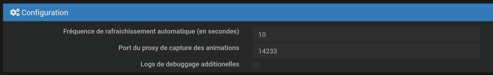

## Découverte et paramétrage des équipements

Depuis la page du plugin (Objets Connectés > Twinkly), il faut ensuite créer ou faire détecter automatiquement les guirlandes. 

**Important** : il est nécessaire que les guirlandes soient configurées préalablement et connectées au réseau wifi en utilisant l'application mobile officielle Twinkly sur iOS ou Android.

La solution la plus simple est d'utiliser le bouton 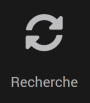 pour lancer la découverte automatique des équipements.

Si la découverte automatique ne fonctionne pas (équipements sur un réseau différent, ou trafic UDP broadcast bloqué), il est possible de créer les équipements manuellement. Il faut alors fournir les informations suivantes :

- L'adresse IP de la guirlande
- L'adresse MAC

Ces 2 informations sont trouvables dans l'application mobile Twinkly.

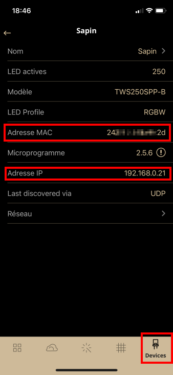

Après sauvegarde de l'équipement, les caractéristiques seront récupérées depuis le contrôleur de la guirlande.

Dans cet écran, il est également possible de désactiver le rafraîchissement automatique des informations, pour ne pas perturber l'application mobile.

## Commandes des équipements

Chaque équipement dispose des commandes suivantes

### Commandes actions

- `On` Allumage de la guirlande (passage au mode "movie")
- ``Off`` Extinction de la guirlande (passage au mode "off")
- ``Luminosité`` Changement du niveau de luminosité de la guirlande (0-100)
- ``Animation`` Chargement vers la guirlande d'une animation préalablement capturée ou importée
- ``Refresh`` Rafraîchissement manuel des informations de la guirlande (état, luminosité)

### Commandes infos

Ces valeurs sont rafraîchies automatiquement à la fréquence choisie sur la page de configuration du plugin, ou manuellement via la commande ``Refresh`` si la mise à jour est désactivée.

- ``Etat luminosité`` Valeur actuelle de la luminosité de la guirlande (0-100)
- ``Etat`` Mode courant de la guirlande (off/movie)

## Gestion des animations et playlists

Les animations disponibles pour chaque équipement (guirlande) sont gérées par la fenêtre accessible en utilisant le bouton 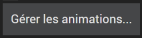

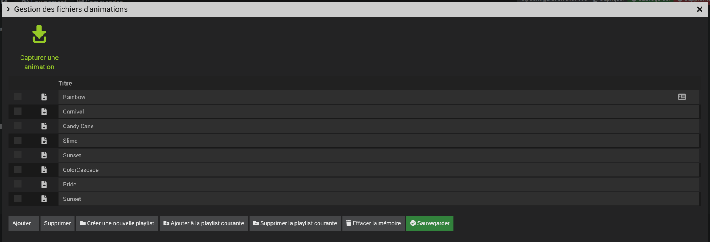

Depuis cette fenêtre, il est possible :

- d'ajouter une animation depuis un fichier zip qui aura préalablement été capture puis sauvegardé sur disque, en utilisant le bouton **Ajouter**
- de supprimer une animation de la liste, en cochant la case correspondante, puis en cliquant sur le bouton **Supprimer**
- de télécharger sur le disque local une animation préalablement capturée en cliquant sur l'icône de téléchargement 
- de changer le titre affiché dans la liste pour chaque animation. La valeur initiale est récupérée lors de la capture pour les guirlandes "gen 2" (compatibles "playlist"). Pour les guirlandes gen1, le nom n'est pas envoyé par l'application mobile, un nom est généré automatiquement lors de la capture
- de réordonner la liste des animations via drag-and-drop, pour choisir l'ordre d'affichage dans la liste déroulante "movies" de l'équipement
- de vider les animations chargées en mémoire. Elles devront être téléchargées de nouveau vers le contrôleur à la prochaine utilisation

Il est également possible de gérer les **playlists**

- Création d'une nouvelle playlist à partir des animations sélectionnées. La playlist actuellement en mémoire est perdue
- Ajout des animations sélectionnées à la playlist courante
- Suppression de la playlist courante

Lors de l'ajout de plusieurs animations à la playlist, l'ordre est le même que l'ordre l'affichage sur l'écran de gestion. Il est possible de réordonner les lignes pour choisir l'ordre voulu avant d'ajouter les animations. Sans cliquer sur le bouton Sauvegarder, l'ordre d'origine sera conservé pour la liste déroulante "movies".

## Capture des animations

Les animations (séquence d'allumage/extinction des leds de la guirlande dans les différentes couleurs), appelées "*movies*" dans l'API Twinkly, sont des fichiers binaires composés de multiples séquences de 3 octets indiquant l'intensité de rouge, vert et bleu pour chacune des leds de la guirlande.

Les animations sont spécifiques à chaque guirlande et sont calculées lors de la phase d'analyse réalisée depuis l'application mobile Twinkly (capture de la disposition des leds via l'appareil photo du smartphone, puis calcul en local ou via le cloud Twinkly).

C'est pourquoi il est nécessaire de récupérer ces fichiers binaires après chaque nouvelle installation de la guirlande, ou changement de disposition.

Le principe utilisé par le plugin est de démarrer un proxy HTTP sur le serveur Jeedom, de configurer le smartphone pour qu'il utilise ce proxy, puis d'utiliser l'application mobile normalement pour envoyer l'animation vers une guirlande. Le proxy se chargera alors de capturer l'animation et les informations associées, et de les stocker sur le disque sous la forme d'un fichier zip.

L'animation sera ensuite directement utilisable par le plugin et pourra être envoyée à volonté vers la guirlande.

On ne peut capturer les animations que pour une seule guirlande à la fois. Pour capturer les animations pour plusieurs guirlandes, il faut répéter les opérations 2 à 5 ci-dessous pour chaque guirlande.

Les étapes du processus de capture sont décrites ci-dessous.

#### Etape 1 - Arrêt du rafraîchissement automatique

Comme expliqué en [introduction](#information-importante), le contrôleur Twinkly est limité à un seul appareil de commande à la fois.

Comme on doit utiliser l'application mobile dans la procédure ci-dessous, il est nécessaire d'interrompre temporairement la collecte automatique des données par le plugin, sous peine de déconnecter l'application mobile pendant son utilisation.

Il suffit de décocher la case **Rafraîchissement auto** de l'équipement et de le sauvegarder avant de lancer le processus de capture, puis de rétablir cette option à la fin du processus.

#### Etape 2 - Démarrage du proxy

**Attention** : cette étape nécessite que l'installation des dépendances depuis la page de configuration du proxy ait été réalisée. Le processus de capture s'appuie sur l'outil *mitmdump* du projet [mitmproxy](https://mitmproxy.org/) qui est installé depuis les repos de la distribution Linux du serveur (Debian la plupart du temps).

Il suffit de cliquer sur le bouton  pour démarrer le proxy.

Un message s'affiche avec les informations à utiliser pour configurer le proxy sur le smartphone (adresse IP et port). L'adresse IP est l'IP interne du serveur Jeedom. Le port est celui choisi dans la [page de configuration générale du plugin]( #installation-du-plugin), ou 14233 par défaut.

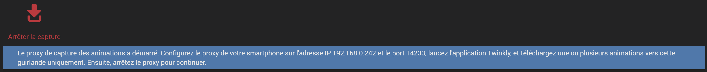

#### Etape 3 - Configuration du smartphone (sur des mobiles Apple)

- Aller dans Réglages > Wi-Fi > Cliquer sur l'icône  à côté du nom du réseau.

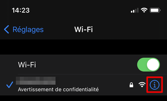

- En bas de la page, sélectionner "PROXY HTTP / Configurer le proxy"

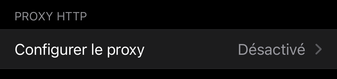

- Puis dans la page de configuration, entrer les informations du proxy affichées sur l'écran du plugin

  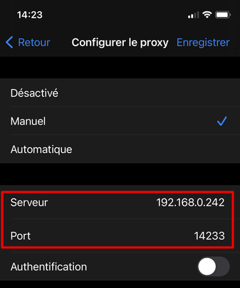

- Enregistrer la configuration

  

#### Etape 3 - Configuration du smartphone (sur des mobiles Android)

En fonction versions d'Android et des différentes surcouches constructeur ou opérateurs, les écrans peuvent être différents sur votre propre smartphone, mais le principe devrait rester le même.

- Accéder à la page des paramètres du réseau Wifi

  

- Accéder aux paramètres avancés

  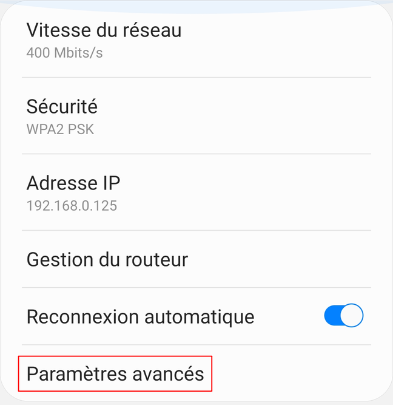

- Sélectionner l'entrée "Proxy" et choisir "Manuel"

  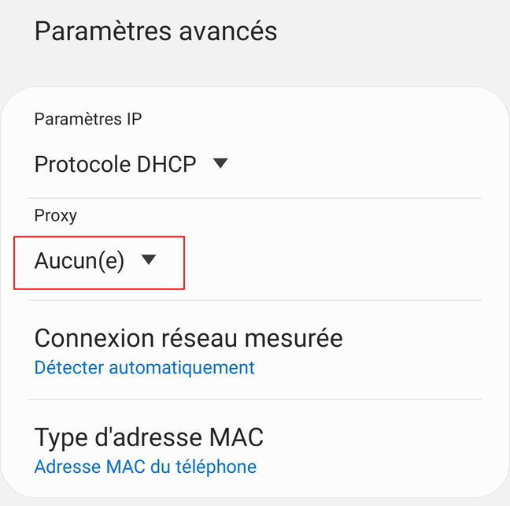

- Entrer les paramètres du proxy affichés sur la page du plugin

  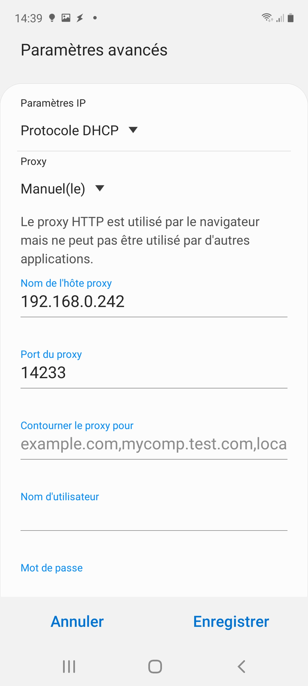

- Enregistrer la configuration

  

#### Etape 4 - Utilisation de l'app mobile Twinkly

Il suffit de lancer l'application mobile Twinkly, de choisir les animations que vous souhaitez capturer dans la galerie et de les envoyer vers le sapin. Attention, afficher l'animation sur l'écran de prévisualisation ne suffit pas, il faut vraiment télécharger l'animation vers la guirlande pour qu'elle puisse être capturée par le proxy.

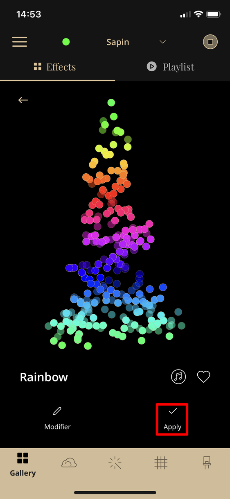

#### Etape 5 - Arrêt de la capture et récupération des fichiers

Cliquer sur le bouton **Arrêter la capture** (voir le *screenshot* plus haut).

Le plugin va récupérer toutes les animations envoyées vers la guirlande et les ajouter à la liste.

Pour les guirlandes "gen2", le titre indiqué est celui fourni par Twinkly. Pour une guirlande "gen1", l'information n'est pas disponible, donc le titre par défaut est le nom du fichier capturé (un GUID). 

Dans les 2 cas, il est bien sûr possible de modifier le titre par défaut (ne pas oublier de cliquer sur le bouton **Sauvegarder** pour conserver les modifications)

Si aucune animation n'a pu être capturée, le message ci-dessous sera affiché.

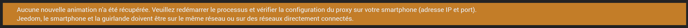

Vérifiez que le proxy a correctement été configuré sur le smartphone et que avez bien envoyé l'animation vers la bonne guirlande.

#### Etape 6 - Désactiver le proxy sur le smartphone

N'oubliez pas de repasser le paramétrage du proxy sur "Aucun" ou "Désactivé" pour rétablir le fonctionnement normal de votre smartphone. Un oubli rendra l'accès wifi inopérant jusqu'à désactivation.

#### Etape 7 - Rétablissement du rafraîchissement automatique

Vous pouvez désormais réactiver le rafraîchissement automatique des informations dans les paramètres de l'équipement.

## Changelog

Le changelog est disponible [ici](changelog.md).